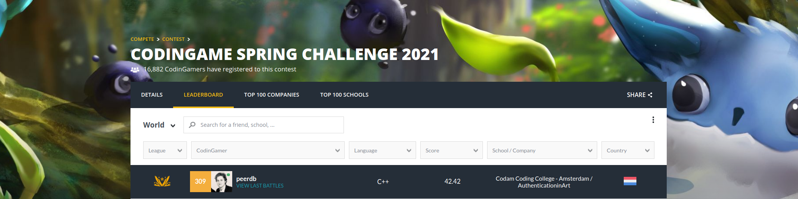
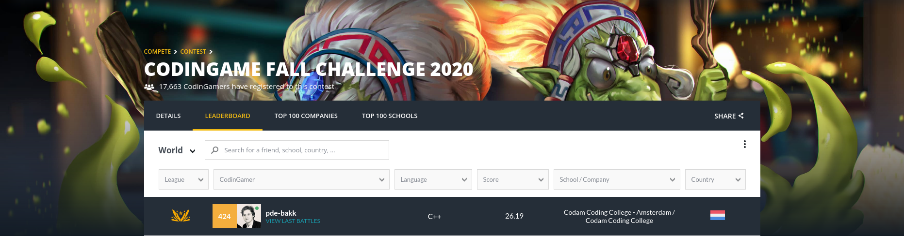
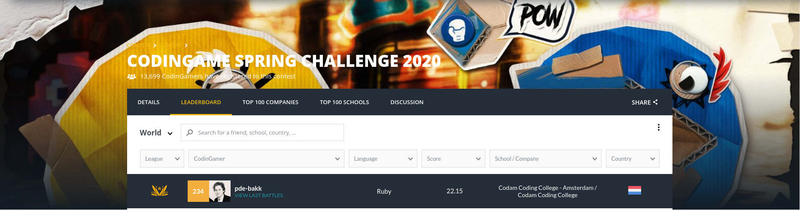

# Codingame

I decided I don't want to make my code public here anymore (I know old source code I posted here is still visible in git commit history but whatever).
If you want to see my source code for whatever reason, just reach out to me on slack or open a GitHub issue in this repo please.

## For the Spring Challenge 2021 (Photosynthesis), I finished 309th out of 6867 participants.
### This time we had a lot more people from Codam taking part, and as a result we pushed Codam into the top 10 of universities worldwide (9th)!

## For the Fall Challenge 2020, I finished 424 out of 7011 participants.

## For the Spring Challenge 2020 (Pacman), I finished 234th out of 4955 participants.

Next autumn there will be another one and I will of course be there again!
